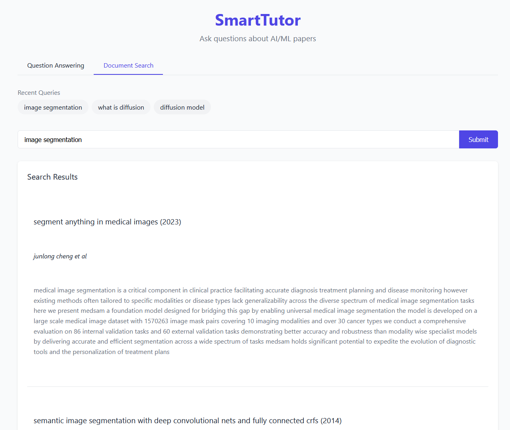

# Setting Up the Project Requirements with UV package manager

## Install `UV`: A Python Package Manager
If you have python installed

```bash
pip install uv
```
Alternatively, install with a standalone installer

```bash
curl -LsSf https://astral.sh/uv/install.sh | sh
```

##  Install Required Packages
The following command will install all the required packages
```bash
uv sync
```

# Functionality

The project currently provides the following functionality:
1. Scrape meta data from arxiv, ieeexplore, sciencedirect and springer
2. Embed the scraped data and push to vector database
3. Download embeddings from vector database


## Scrape Meta Data
The following command will generate necessary cleaned resources in cache
```bash
uv run main.py --scrape
```
* You need to have **google chrome** installed if you're going to use the scrape function.

## Embed the scraped data and push to vector database

Set up the database password environment variable 
```bash
export VECTOR_DB_PWD=thepasswordprovided
```

The following command will extract embedding from the scraped cache and push to the vectordb.
The collection name needs to be a valid table name, so it can't contain special characters.
The model name is optional, and defaults to "Alibaba-NLP/gte-multilingual-base", check the [Embedding Models Used](#embedding-models-used) section for more details.
```bash
uv run main.py -g <collection_name> --model <model_name>
```

Example:
```bash
uv run main.py -g gte --model "Alibaba-NLP/gte-multilingual-base"
```

## Download Embeddings from vector database

The following command will download the embeddings from the vector database into a cache folder
```bash
uv run main.py -d <collection_name> --cache_dir <cache_dir>
```

Example:
```bash
uv run main.py -d gte --cache_dir embeddings
```

## How to use RAG and Search for relevant papers

### Method 1: Use the command line

We provided a simple interactive command line interface to use RAG and Search for relevant papers.

```bash
# To start the interactive RAG interface
uv run main.py --rag <collection_name>

# To start the interactive search interface
uv run main.py --search <collection_name>
```

Example:
```bash
uv run main.py --rag gte
```

### Method 2: Use the API and (Optional) Web UI

The following command will run the web UI
```bash
uv run main.py --api <collection_name>

# If you want to run the API on a specific host and port
uv run main.py --api <collection_name> --api_host <host> --api_port <port>
```
Example:
```bash
uv run main.py --api gte --api_host 0.0.0.0 --api_port 8000
```

We proivde a local web UI to use the API, you can access it by opening the `web_ui.html` file in your browser.




# Statistics
## Papers

We manually categorized the papers into the following categories

|    | category      |   count | description                              |
|---:|:--------------|--------:|:-----------------------------------------|
|  0 | ml_general    |      89 | General Machine Learning                 |
|  1 | dl_nlp        |      56 | Deep Learning for NLP                    |
|  2 | cv_pattern    |      53 | Computer Vision Pattern Recognition      |
|  3 | cv_generative |      43 | Computer Vision Generative Models        |
|  4 | dl_rnn        |      36 | Deep Learning with RNNs                  |
|  5 | audio         |      25 | Audio                                    |
|  6 | dl_rl         |      18 | Deep Learning for Reinforcement Learning |

## Embedding Models Used
The following models are used and tested for embedding the scraped data, you can use other huggingface models as well. However, some models might not be supported by the langchain huggingface module.
1. Alibaba-NLP/gte-multilingual-base
2. NovaSearch/jasper_en_vision_language_v1